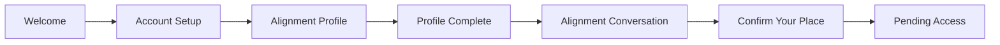

# Authentic

Authentic is an Expo React Native app for intentional Christian community onboarding. The current
MVP guides a user through account setup, the Alignment Profile, an Alignment Conversation
confirmation flow, and a Pending Access state while the rest of Community Access is still locked.

## Current MVP Flow

## Tech Stack

- Expo SDK 56
- React Native 0.85
- React Navigation
- Supabase Auth + database
- Zustand for persisted auth and booking state
- Zod for onboarding validation
- Jest + React Native Testing Library

## Setup

1. Install dependencies with `npm install`.
2. Copy `.env.example` into `.env.local` and fill in the required values.
3. Start the app with `npm start`.
4. Run tests with `npx jest --runInBand`.
5. Run a type check with `npx tsc --noEmit`.

## Required Environment Variables

| Variable | Required | Purpose |
| --- | --- | --- |
| `EXPO_PUBLIC_APP_SCHEME` | Yes | Deep-link scheme used for auth callbacks |
| `EXPO_PUBLIC_SUPABASE_URL` | Yes | Supabase project URL |
| `EXPO_PUBLIC_SUPABASE_PUBLISHABLE_KEY` | Yes | Supabase publishable anon key |
| `EXPO_PUBLIC_IOS_BUNDLE_IDENTIFIER` | Recommended | iOS bundle identifier for local/native builds |
| `EXPO_PUBLIC_ANDROID_PACKAGE` | Recommended | Android package name for local/native builds |
| `EAS_PROJECT_ID` | Optional | EAS project identifier used in app config |

## Expected Supabase Tables

The app currently expects these tables or equivalents to exist:

- `profiles`
- `onboarding_responses`
- `preferences`
- `available_slots`
- `bookings`
- `guide_profiles`
- `availability_windows`

## Current Scope

Current in-app scope is:

- account setup with email and social auth
- Alignment Profile completion with local persistence
- Alignment Conversation scheduling with a mock slot source behind `slotService`
- mock Confirmation Fee flow
- Pending Access holding state after scheduling

Guide dashboards, real payment processing, and full calendar sync remain future work.
