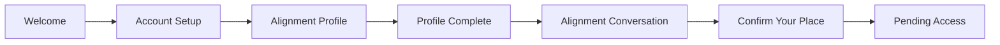

# Authentic

Authentic is an Expo React Native app for intentional Christian community onboarding. The current
MVP guides a user through account setup, the Alignment Profile, an Alignment Conversation
confirmation flow, and a Pending Access state while the rest of Community Access is still locked.

## Current MVP Flow



## Tech Stack

- Expo SDK 56
- React Native 0.85
- React Navigation
- Supabase Auth + database
- Zustand for persisted auth and booking state
- Zod for onboarding validation
- Jest + React Native Testing Library

## Setup

1. Install dependencies with `npm install`.
2. Copy `.env.example` into `.env.local` and fill in the required values.
3. Start the app with `npm start`.
4. Run tests with `npx jest --runInBand`.
5. Run a type check with `npx tsc --noEmit`.

## Required Environment Variables

| Variable | Required | Purpose |
| --- | --- | --- |
| `EXPO_PUBLIC_APP_SCHEME` | Yes | Deep-link scheme used for auth callbacks |
| `EXPO_PUBLIC_SUPABASE_URL` | Yes | Supabase project URL |
| `EXPO_PUBLIC_SUPABASE_PUBLISHABLE_KEY` | Yes | Supabase publishable anon key |
| `EXPO_PUBLIC_GOOGLE_WEB_CLIENT_ID` | Yes for Google auth | Google Web OAuth client ID reused for Android native ID-token sign-in and Supabase Google auth |
| `EXPO_PUBLIC_IOS_BUNDLE_IDENTIFIER` | Recommended | iOS bundle identifier for local/native builds |
| `EXPO_PUBLIC_ANDROID_PACKAGE` | Recommended | Android package name for local/native builds |
| `EAS_PROJECT_ID` | Optional | EAS project identifier used in app config |

`EXPO_PUBLIC_*` values are bundled into the app and should be treated as public. Do not place Google client secrets, Apple private keys, or Supabase service-role keys in Expo env files.

For EAS remote builds, set the same values in EAS environments because `.env.local` is not uploaded to EAS builders. Example preview setup:

```bash
eas env:create --environment preview --name EXPO_PUBLIC_SUPABASE_URL --value "https://your-project.supabase.co"
eas env:create --environment preview --name EXPO_PUBLIC_SUPABASE_PUBLISHABLE_KEY --value "your-supabase-publishable-key"
eas env:create --environment preview --name EXPO_PUBLIC_APP_SCHEME --value "authenticcdc"
eas env:create --environment preview --name EXPO_PUBLIC_ANDROID_PACKAGE --value "com.richiewaweru.authenticcdc"
eas env:create --environment preview --name EXPO_PUBLIC_GOOGLE_WEB_CLIENT_ID --value "your-google-web-client-id.apps.googleusercontent.com"
```

Android preview APKs and production app bundles are configured in [eas.json](/C:/Projects/Authentic/eas.json).

## Expected Supabase Tables

The app currently expects these tables or equivalents to exist:

- `profiles`
- `onboarding_responses`
- `preferences`
- `available_slots`
- `bookings`
- `guide_profiles`
- `availability_windows`

## Current Scope

Current in-app scope is:

- account setup with email and social auth
- Alignment Profile completion with local persistence
- Alignment Conversation scheduling with a mock slot source behind `slotService`
- mock Confirmation Fee flow
- Pending Access holding state after scheduling

Guide dashboards, real payment processing, and full calendar sync remain future work.
